  
  
  

---

## 我是谁
独立开发者，关注 **AI 机会挖掘、快速验证、工程化交付**。偏好做“能上线、能迭代、能增长”的小产品，从 0 → 1 打通闭环。

## 现在在做什么
- 从公开信号（Product Hunt / Reddit / HN 等）提炼 **2C AI 机会**，配套 PRD、执行清单与增长策略
- 将想法快速做成 MVP，上线验证，基于数据迭代
- 关注：增长、数据闭环、自动化、工具链

## 精选项目（Projects）
### AI Daily Opportunities
- 仓库：**https://github.com/Gjts/AI-Daily-Opportunities**
- 简介：面向独立开发者的 2C AI 机会清单（机会筛选 → PRD → 执行清单 → 增长策略）

### SuperOPC / superopc-marketplace
- 仓库：**https://github.com/Gjts/SuperOPC**
- 仓库：**https://github.com/Gjts/superopc-marketplace**
- 简介：核心项目入口与实践仓库（建议你在这里补一句：给谁用 / 解决什么痛点 / 当前进度）

### EasyGoVibeCoding
- 仓库：**https://github.com/Gjts/EasyGoVibeCoding**
- 简介：vibe coding 实验与工具化沉淀（建议补一句：你沉淀了哪些可复用产物）

## 技术栈（Tech Stack）

  
  
  
  

---

---

## 动态效果（可选，但推荐）
如果你启用了 snake 动画（见下方 workflow），这里会显示贡献蛇：

  

